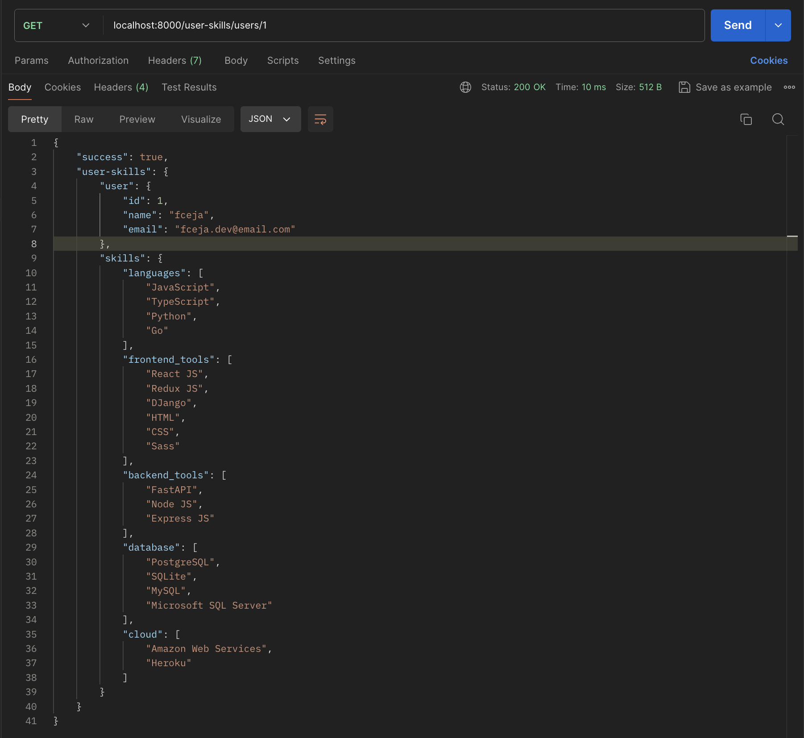

# Description
A simple API using Python and the FastAPI library.


# Install
1. Install Python3
   ```
   https://www.python.org/downloads/
   ```
2. Clone repo
3. Create virtual environment
   ```
   python3 -m venv venv
   ```

4. Install dependencies, at project root run:
   ```
   pip install -r requirements.txt
   ```
5. Run
   ```
   uvicorn app.main:app --host 0.0.0.0 --port 8000 --reload
   ```

## Endpoint
```
localhost:8000/user-skills/users/1
```
Response


